# Open Inventor（.iv）文件格式

本控件用 Coin3D 加载 **Open Inventor** 场景文件（`.iv`）。文件描述的是一棵**场景图**（scene graph）：节点按父子顺序排列，遍历时把材质、变换等状态施加到后面的几何体上。

仓库里的示例在 [`design/default/data`](../design/default/data)。下文插图均为 `./bin/demo --screenshot` 从控件真实渲染导出。用 demo 打开后效果如下：

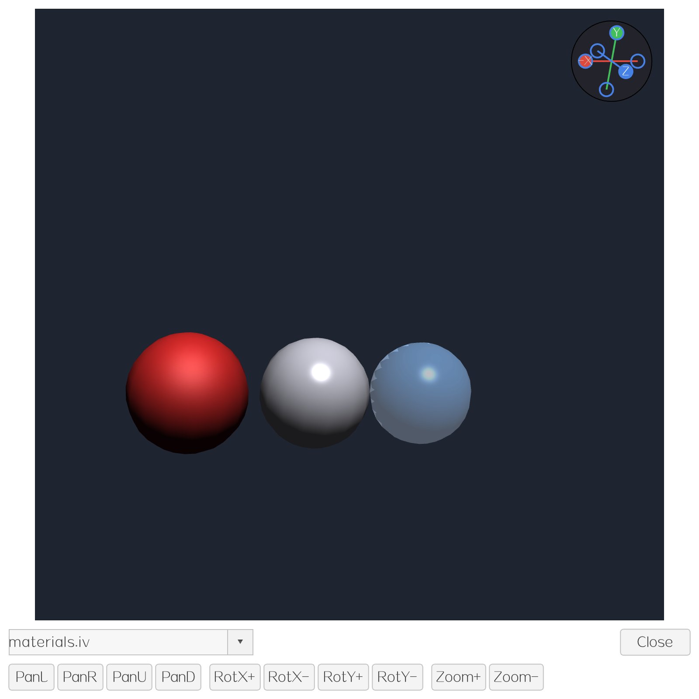

```
./bin/demo design/default/data/materials.iv
```

## 文件头

ASCII 文件必须以版本行开头（建议用 2.1）：

```
#Inventor V2.1 ascii
```

也常见 `#Inventor V1.0 ascii`。`#` 表示注释。二进制 `.iv` Coin 也能读，但不便编辑，本文只讲 ASCII。

## 场景图

常用根节点是 `Separator`：进入时保存状态，离开时恢复。因此每个子 `Separator` 里的材质、平移不会泄漏到兄弟节点。

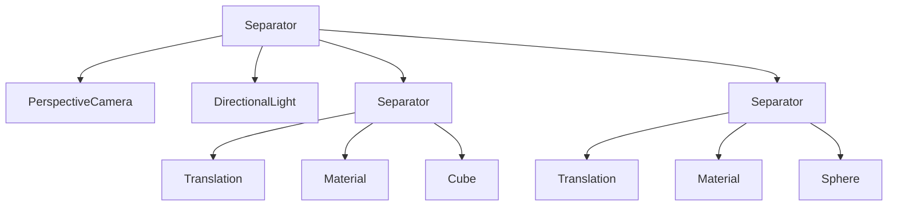
```mermaid
flowchart TB
  root["Separator"]
  root --> cam["PerspectiveCamera"]
  root --> light["DirectionalLight"]
  root --> cubeSep["Separator"]
  root --> sphereSep["Separator"]
  cubeSep --> t1["Translation"]
  cubeSep --> m1["Material"]
  cubeSep --> cube["Cube"]
  sphereSep --> t2["Translation"]
  sphereSep --> m2["Material"]
  sphereSep --> sphere["Sphere"]
```

对应结构：

```
#Inventor V2.1 ascii

Separator {
  PerspectiveCamera { position 0 0 10 }
  DirectionalLight { direction 0.2 -1 -0.5 }

  Separator {
    Translation { translation -2 0 0 }
    Material { diffuseColor 0.9 0.3 0.25 }
    Cube { }
  }
  Separator {
    Translation { translation 2 0 0 }
    Material { diffuseColor 0.25 0.7 0.95 }
    Sphere { }
  }
}
```

`Group` 也能当容器，但**不**隔离状态，后面的节点会继承前面的材质和变换。组合物体时优先用 `Separator`。

文件里如果没有相机或灯光，控件加载时会自动补上 `PerspectiveCamera` 和 `DirectionalLight`，再 `viewAll`。

## 最小文件

几何节点可以单独作为整棵场景。控件会补相机和灯：

```
#Inventor V1.0 ascii

Cube {
}
```

完整文件：[`cube.iv`](../design/default/data/cube.iv)、[`sphere.iv`](../design/default/data/sphere.iv)、[`cone.iv`](../design/default/data/cone.iv)、[`cylinder.iv`](../design/default/data/cylinder.iv)。

## 基本几何

| 节点 | 常用字段 | 默认 |
| --- | --- | --- |
| `Cube` | `width` `height` `depth` | 各为 2 |
| `Sphere` | `radius` | 1 |
| `Cone` | `bottomRadius` `height` `parts` | 半径 1、高 2 |
| `Cylinder` | `radius` `height` `parts` | 半径 1、高 2 |

[`primitives.iv`](../design/default/data/primitives.iv) 把四种形状排成一排：

```
Separator {
  Translation { translation -3.6 0 0 }
  Material { diffuseColor 0.9 0.3 0.25 }
  Cube { }
}
Separator {
  Translation { translation -1.2 0 0 }
  Material { diffuseColor 0.25 0.7 0.95 }
  Sphere { }
}
Separator {
  Translation { translation 1.2 0 0 }
  Material { diffuseColor 0.95 0.75 0.2 }
  Cone { }
}
Separator {
  Translation { translation 3.6 0 0 }
  Material { diffuseColor 0.35 0.85 0.4 }
  Cylinder { }
}
```


## 材质

`Material` 影响其后（同一 `Separator` 内）的几何体：

| 字段 | 含义 |
| --- | --- |
| `diffuseColor` | 漫反射颜色，RGB，范围 0–1 |
| `ambientColor` | 环境光反射 |
| `specularColor` / `shininess` | 高光颜色与锐度（0–1） |
| `emissiveColor` | 自发光 |
| `transparency` | 透明度，0 不透明，1 全透明 |

[`materials.iv`](../design/default/data/materials.iv) 对比哑光红、高光灰、半透明蓝：

```
Material {
  diffuseColor 0.8 0.15 0.15
  specularColor 0.2 0.2 0.2
  shininess 0.1
}
```


颜色可以写成数组，再配 `MaterialBinding`，给立方体每个面不同颜色（[`color_cube.iv`](../design/default/data/color_cube.iv)）：

```
Material {
  diffuseColor [
    0.90 0.22 0.21,
    0.20 0.66 0.33,
    0.18 0.45 0.85,
    0.95 0.77 0.16,
    0.61 0.35 0.85,
    0.15 0.78 0.78
  ]
}
MaterialBinding { value PER_FACE }
Cube { }
```

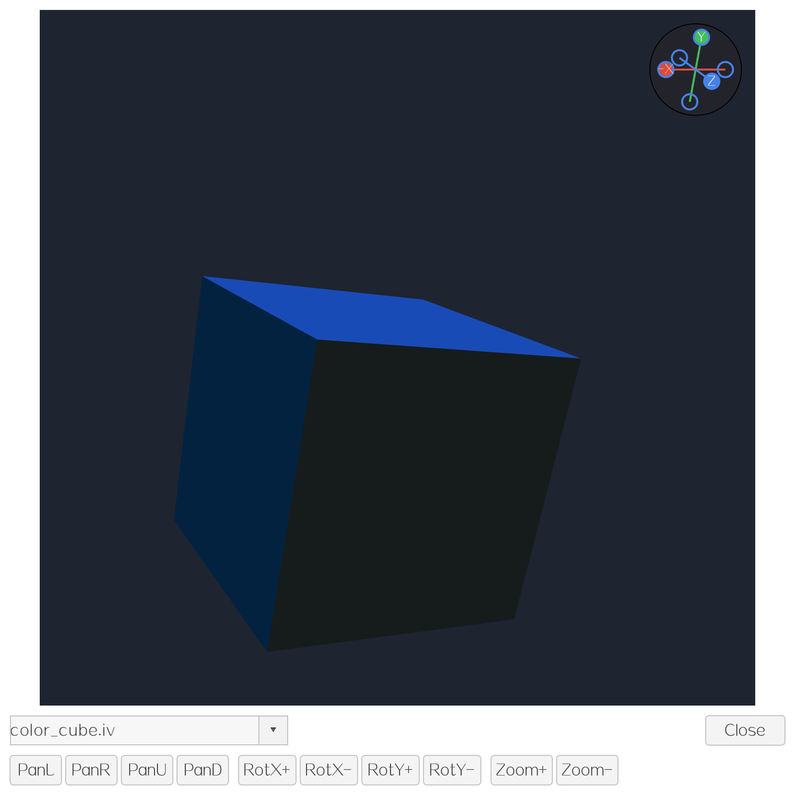

## 变换

变换节点改变**其后**几何体的位置、朝向、大小。角度单位是**弧度**。

| 节点 | 作用 |
| --- | --- |
| `Translation` | `translation x y z` |
| `RotationXYZ` | `axis X\|Y\|Z` 与 `angle`（弧度） |
| `Rotation` | `rotation x y z angle`（轴 + 弧度） |
| `Scale` | `scaleFactor x y z` |
| `Transform` | 同时写平移、旋转、缩放、中心 |
| `MatrixTransform` | 4×4 矩阵，导出模型里常见 |

`robot.iv` 用平移和旋转拼出一个小人：

```
Separator {
  Translation { translation 0 1.55 0 }
  Material { diffuseColor 0.95 0.78 0.55 }
  Sphere { radius 0.45 }
}
Separator {
  Translation { translation -0.95 0.45 0 }
  RotationXYZ { axis Z angle -0.25 }
  Material { diffuseColor 0.95 0.78 0.55 }
  Cylinder { radius 0.16 height 1.1 }
}
```

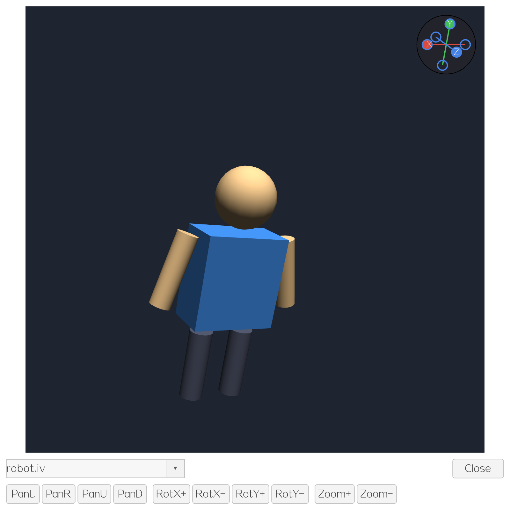

完整文件：[`robot.iv`](../design/default/data/robot.iv)。

## 节点命名（DEF / USE）

`.iv` **没有**通用的 `name` 字段。给节点起名用 `DEF`：

```
DEF <名字> <节点类型> { ... }
```

之后可以用 `USE <名字>` 引用同一节点（共享，不是拷贝）。本控件的 `coin3d_find_node`、`coin3d_node_move` 等按 **DEF 名**查找。

[`named_nodes.iv`](../design/default/data/named_nodes.iv)：

```
#Inventor V2.1 ascii

Separator {
  DEF box Separator {
    Transform { translation 0 0 0 }
    Material { diffuseColor 0.9 0.3 0.25 }
    Cube { }
  }
  DEF ball Separator {
    Transform { translation 2.5 0 0 }
    Material { diffuseColor 0.25 0.7 0.95 }
    Sphere { }
  }
  DEF mover Transform {
    translation 2 0 0
  }
}
```

`ball` 在立方体右侧，避免和 `box` 重叠；`mover` 是独立的 `Transform`，方便运行时改变换。

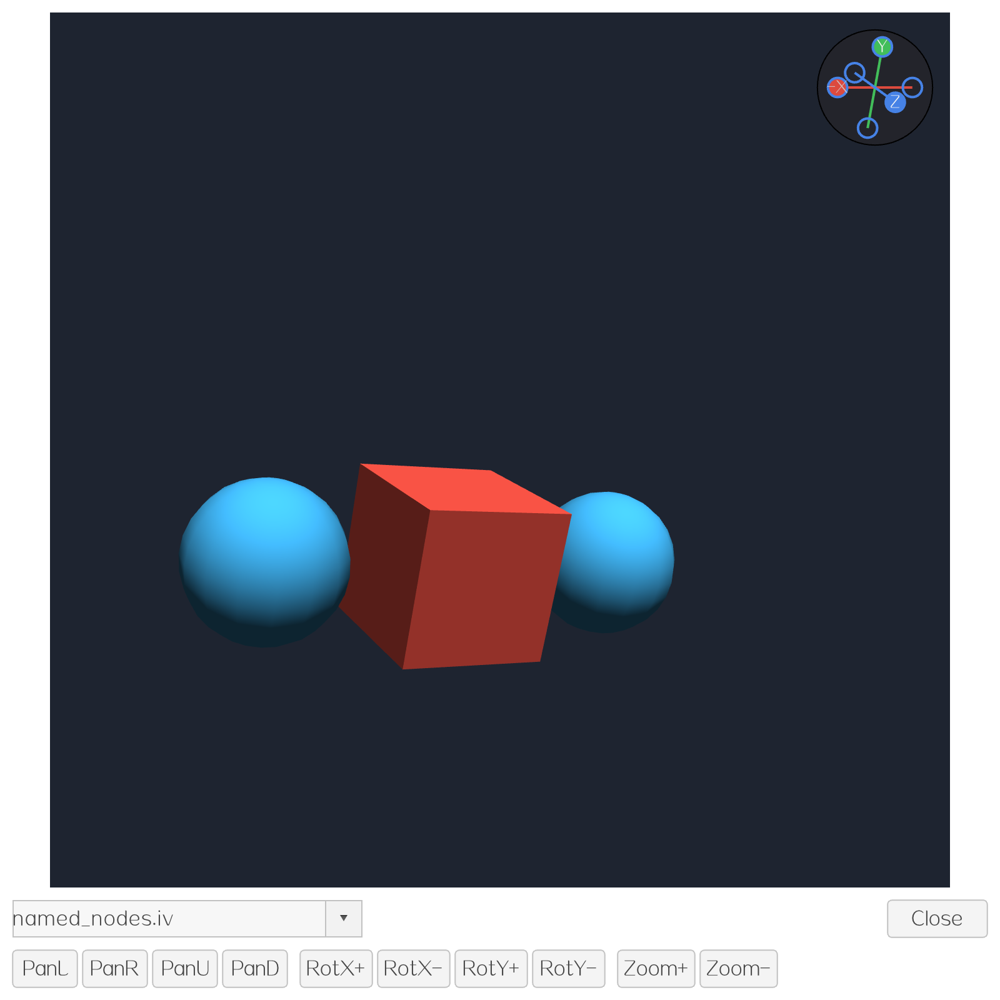

```c
if (coin3d_find_node(coin3d, "box") != NULL) {
  coin3d_node_move(coin3d, "box", 1.0f, 0.0f, 0.0f);
  coin3d_node_rotate(coin3d, "box", 0.0f, 45.0f, 0.0f);
}
```

注意：

- 名字建议以字母或 `_` 开头，由字母、数字、下划线组成；同一文件内应唯一（查找命中第一个）。
- `Font { name "Times-Roman" }` 里的 `name` 是**字体名**，不是节点名。
- 没写 `DEF` 的节点没有名字，运行时找不到。
- 要对一组物体一起动，把 `DEF` 写在外层 `Separator` 或 `Transform` 上。
- 控件 API 的旋转单位是**度**；`.iv` 里 `Rotation` / `RotationXYZ` 的 `angle` 是**弧度**。

`USE` 可复用几何。[`temple.iv`](../design/default/data/temple.iv) 先定义柱子，再多次引用：

```
DEF COLUMN+1 Cylinder {
  radius 0.017140999
  height 0.222021
}
...
USE COLUMN+1
```

## 相机与灯光

| 节点 | 常用字段 |
| --- | --- |
| `PerspectiveCamera` | `position` `orientation` `nearDistance` `farDistance` `heightAngle` |
| `OrthographicCamera` | 正交投影 |
| `DirectionalLight` | `direction` `color` `intensity` |
| `PointLight` | `location` |
| `SpotLight` | `location` `direction` `cutOffAngle` |

示例：

```
PerspectiveCamera {
  position 0 0 5
  nearDistance 0.01
  farDistance 100
}
DirectionalLight {
  direction 0.2 -1 -0.5
}
```

装模型时控件会 `viewAll`。`translation` / `rotation` / `scale` 须在装模型之后设置，否则会被 `viewAll` 覆盖。

## 纹理

`Texture2` 可贴图。可以引用外部图片（`filename`），也可以内嵌像素（`image`）。[`textured_cube.iv`](../design/default/data/textured_cube.iv) 用 8×8 棋盘格：

```
Texture2 {
  image 8 8 3
  0xffe8c36a 0xff2b3548 0xffe8c36a ...
}
Material { diffuseColor 1 1 1 }
Cube { }
```

`image` 后是宽、高、通道数（2=亮度+透明，3=RGB，4=RGBA），然后是像素。

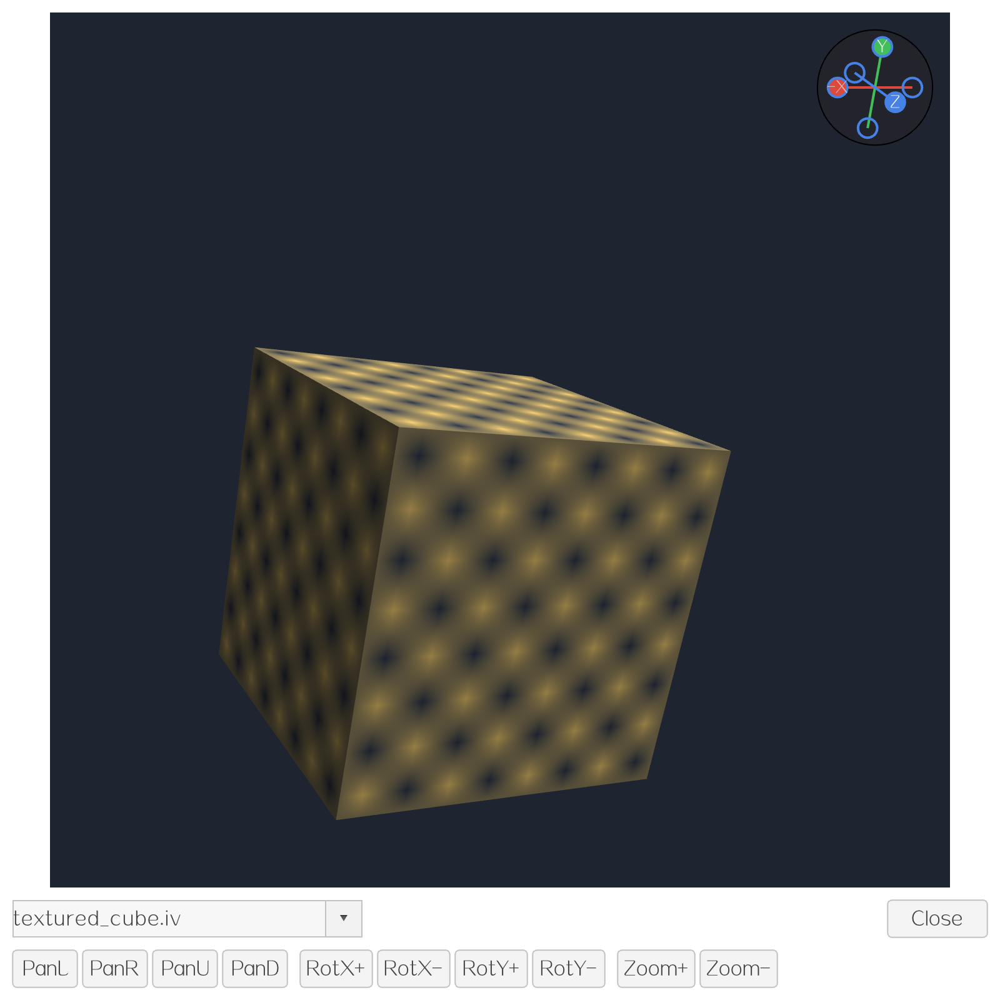

## 绘制样式

`DrawStyle` 可改成线框、点等：

```
DrawStyle {
  style LINES
  lineWidth 2
}
Material { diffuseColor 0.35 0.85 1 }
Sphere { }
```

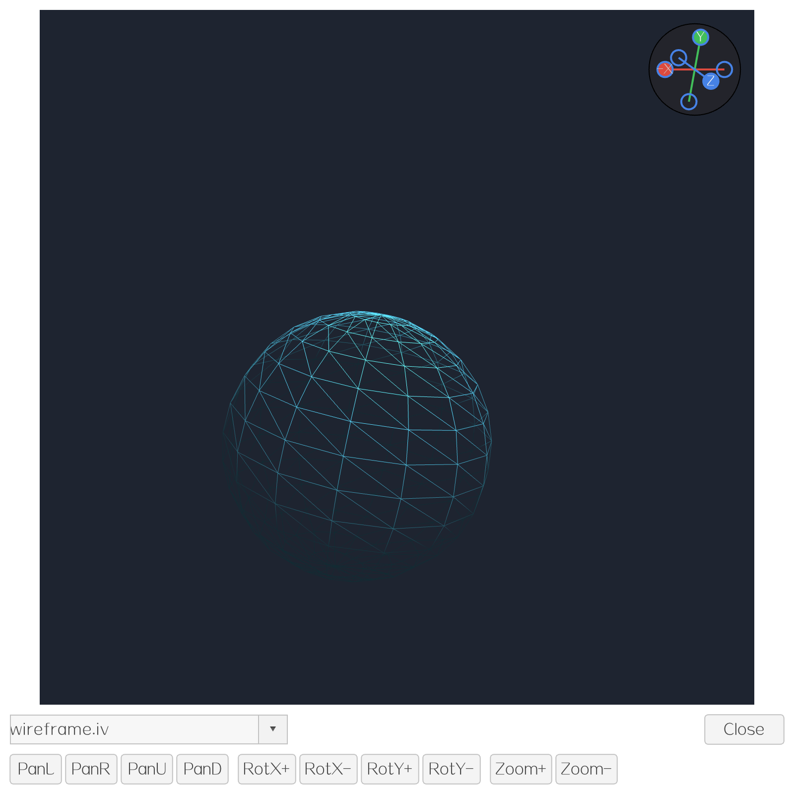

完整文件：[`wireframe.iv`](../design/default/data/wireframe.iv)。`style` 常见取值：`FILLED`、`LINES`、`POINTS`。

地面网格用 `IndexedLineSet` 画在 XZ 平面（Y=0）。`LightModel { model BASE_COLOR }` 让线不受光照变暗。[`ground_grid.iv`](../design/default/data/ground_grid.iv) 在网格上放了立方体、球和锥；中心 X 轴偏红、Z 轴偏蓝：

```
DEF ground Separator {
  LightModel { model BASE_COLOR }
  DrawStyle { style LINES lineWidth 1 }
  BaseColor { rgb 0.32 0.38 0.46 }
  Coordinate3 { point [ -5 0 -5,  5 0 -5, ... ] }
  IndexedLineSet { coordIndex [ 0, 1, -1,  2, 3, -1, ... ] }
}
```

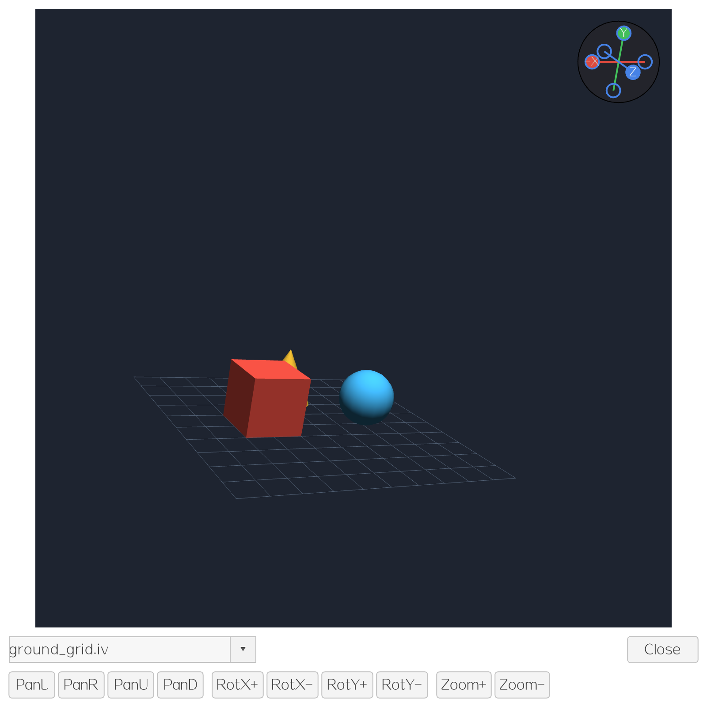

## 动画节点

这些节点会随时间改变换或切换子节点，demo 里可以看到运动：

| 节点 | 作用 | 示例 |
| --- | --- | --- |
| `Rotor` | 绕轴旋转 | [`rotating_cube.iv`](../design/default/data/rotating_cube.iv)、[`solar.iv`](../design/default/data/solar.iv) |
| `Shuttle` | 在两点间平移 | [`shuttle.iv`](../design/default/data/shuttle.iv) |
| `Pendulum` | 在两姿态间摆动 | [`pendulum.iv`](../design/default/data/pendulum.iv) |
| `Blinker` | 按速度切换子节点 | [`blinker.iv`](../design/default/data/blinker.iv) |

`Rotor` 示例（[`rotating_cube.iv`](../design/default/data/rotating_cube.iv)）：

```
Rotor {
  rotation 0 1 0  0.05
  speed 0.2
  on TRUE
}
Material { diffuseColor 0.2 0.7 1 }
Cube { }
```

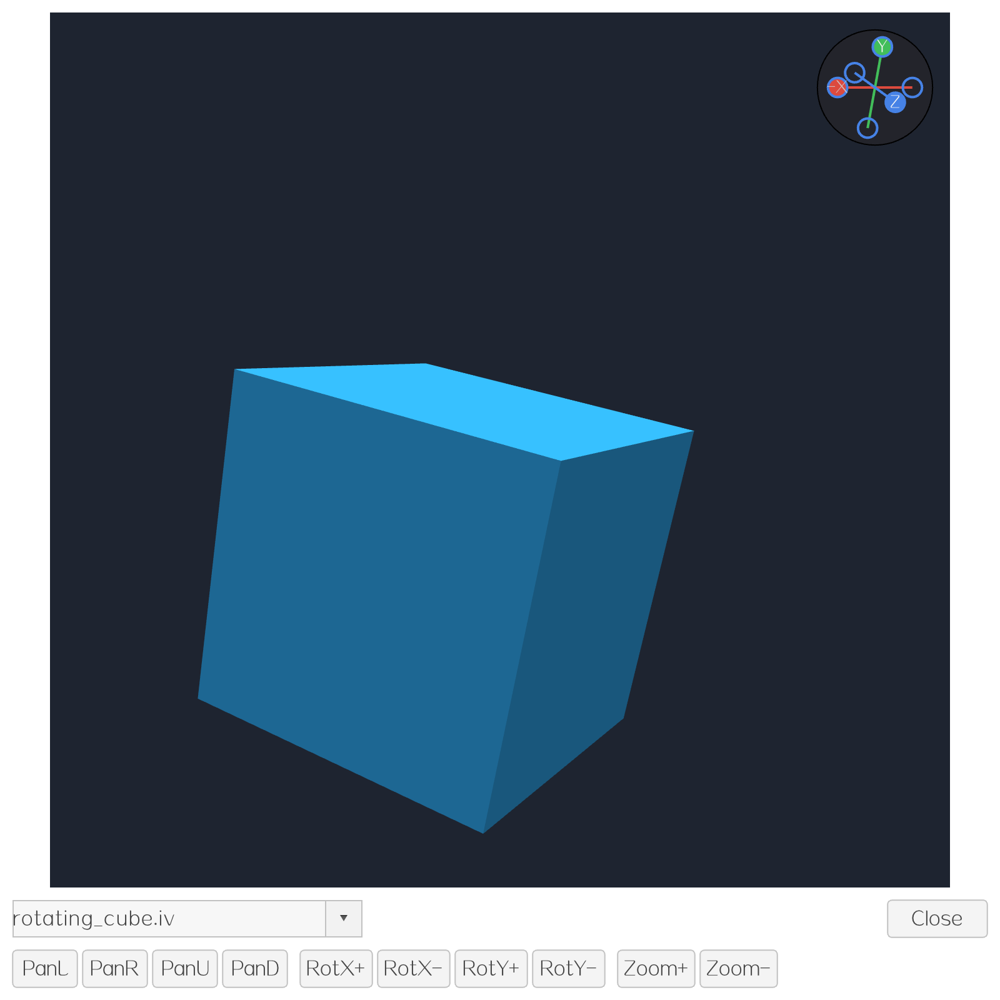

`solar.iv`：太阳在原点，`Rotor` 带着后面的行星转：

```
Separator {
  Material {
    diffuseColor 1 0.82 0.2
    emissiveColor 0.45 0.28 0.02
  }
  Sphere { radius 1.15 }
}
Rotor {
  rotation 0 1 0  0.05
  speed 0.18
  on TRUE
}
Translation { translation 3.8 0 0 }
Material { diffuseColor 0.2 0.5 0.95 }
Sphere { radius 0.4 }
```

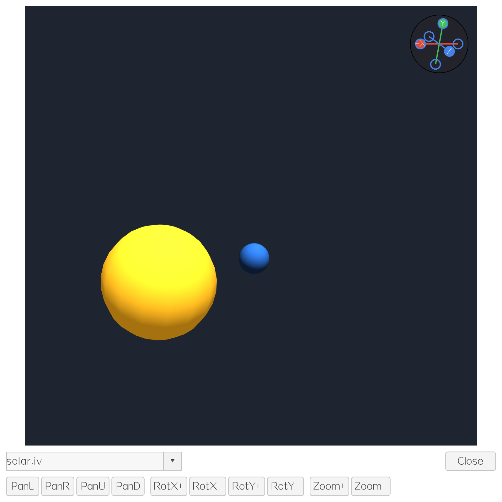

`Blinker` 会轮流显示子节点（立方体 / 球 / 锥 / 柱）：

```
Blinker {
  speed 0.5
  Cube { }
  Sphere { }
  Cone { }
  Cylinder { }
}
```

## 引用其它文件

`File` 可以把另一个 `.iv` 或 `.stl` 嵌进当前场景（相对当前文件目录，或控件搜索的 `design/default/data`）：

```
File {
  name "cube.iv"
}
```

[`include_files.iv`](../design/default/data/include_files.iv) 用 `File` 拼出和 `primitives.iv` 类似的一排形状：立方体、球、锥、柱分别来自 `cube.iv`、`include_part.iv`、`cone.iv`、`cylinder.iv`。被引用文件里的 `DEF`（如 `included_part`）可以用 `coin3d_find_node` 找到。

[`include_stl.iv`](../design/default/data/include_stl.iv) 演示在同一 `.iv` 里混用 `File` 引用 `.stl` 与 `.iv`：从左到右依次为 ASCII `pyramid.stl`、彩色 `color_pyramid.stl`、二进制 `pyramid_binary.stl` 与 `cube.iv`。`.stl` 会在加载时先转为临时 `.iv` 再嵌入场景图；`.iv` 文件本身也会读入内存后解析，以便嵌套 include 时稳定加载 STL。

```
Separator {
  Translation { translation -3.6 0 0 }
  File { name "pyramid.stl" }
}
Separator {
  Translation { translation 1.2 0 0 }
  File { name "pyramid_binary.stl" }
}
Separator {
  Translation { translation 3.6 0 0 }
  Material { diffuseColor 0.95 0.75 0.2 }
  File { name "cube.iv" }
}
```

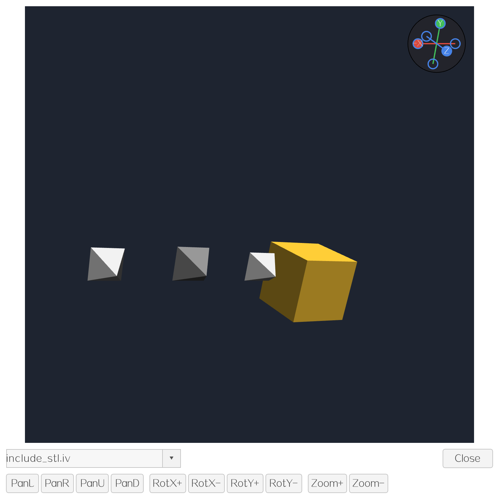

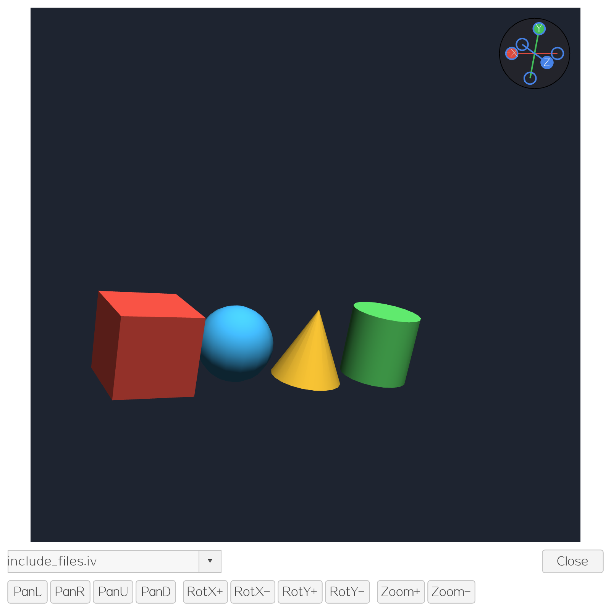

复杂模型（如 `flower.iv`、`temple.iv`）一般是导出时把几何直接写进一个文件，不一定拆成 `File`。

## 仓库示例一览

| 文件 | 说明 |
| --- | --- |
| `cube.iv` / `sphere.iv` / `cone.iv` / `cylinder.iv` | 单个默认几何 |
| `primitives.iv` | 四种形状 + 平移、材质 |
| `materials.iv` | 哑光 / 高光 / 透明 |
| `color_cube.iv` | 每面不同颜色 |
| `textured_cube.iv` | 内嵌棋盘格纹理 |
| `wireframe.iv` | `DrawStyle LINES` |
| `ground_grid.iv` | XZ 地面网格 + 物体 |
| `named_nodes.iv` / `named_cube.iv` | `DEF` 命名，供节点 API |
| `include_files.iv` / `include_part.iv` | `File` 引用其它 `.iv` |
| `include_stl.iv` | `File` 引用 `.stl` 与 `.iv` 混排 |
| `rotating_cube.iv` / `shuttle.iv` / `pendulum.iv` / `blinker.iv` | 动画 |
| `solar.iv` | `Rotor` + 自发光 |
| `robot.iv` | 用基本体组合 |
| `temple.iv` / `luxo.iv` / `windmillVanes.iv` | `DEF` + `USE` 复用 |
| `flower.iv` / `desk.iv` / `duck.iv` 等 | 导出的复杂网格 |

资源打包后，`cube.iv` 在 AWTK 资源里常登记为 `cube_iv`。`model` 可以写资源名或本地路径。

## 编写建议

1. 第一行写 `#Inventor V2.1 ascii`。
2. 根用 `Separator`；每件独立物体再包一层 `Separator`。
3. 需要运行时移动、旋转的节点加上 `DEF`。
4. 颜色是 0–1 的 RGB，不是 0–255。
5. `.iv` 里角度是弧度；控件 `coin3d_node_rotate` 用度。
6. 改完 `design/default/data` 或 `design/default/ui` 后执行 `python scripts/update_res.py all` 再运行 demo。
7. 更新本文插图：`./bin/demo --screenshot docs/images/xxx.png <模型.iv>`。

更完整的节点列表见 [Coin / Open Inventor 文档](https://github.com/coin3d/coin)。
